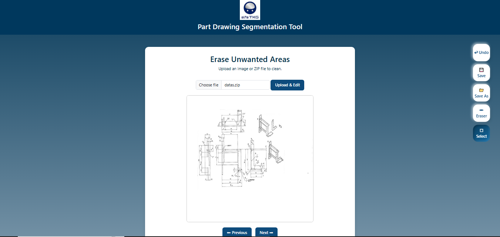

# Partdrawing Mask Viewer
A clean and user-friendly web application to **view part drawing masks** and **erase unwanted areas** interactively.

# Features
-  Upload and view multiple part drawing images with masks.  
-  Navigate between images using **Previous** and **Next** buttons.  
-  **Eraser Tool:** Remove unwanted parts of drawings directly on the canvas.  
-  **Select & Delete:** Choose areas to erase precisely (like MS Paint).  
-  Save edited images or export all files together.  
-  Smooth scrolling, modern UI, and responsive layout.
- 
## Tech Stack
- **HTML5**  
- **CSS3** (modern layout & styling)  
- **JavaScript** (image control, eraser, selection, navigation)  

# Folder Structure
Mask website/
├── index.html # Mask Viewer page
├── clean.html # Eraser Tool page
├── app.py # Flask backend
├── static/
│ ├── images/ # Logos and assets
│ ├── css/ # Stylesheets
│ └── js/ # JavaScript files
└── README.md # Project info

# Usage
1. Open **`index.html`** in your browser.
    Upload:
   - A part drawing image & A mask image to overlay.  
   - Use **← Previous Image** and **Next Image →** to switch between loaded samples.
2. Use the **Eraser Tool** page to upload drawings and erase unwanted parts.  
   Click **Save** to store changes or **Save As** to download all edited files.

# Homepage
Two tool are available

# Upload Section
Users can upload ZIP files containing noisy images and masks.

# Image + Mask Viewer
View part drawings with corresponding colored mask overlays.

# Segmentation
Select and erase unwanted things manually

# License
This project is open for educational and personal use.  
