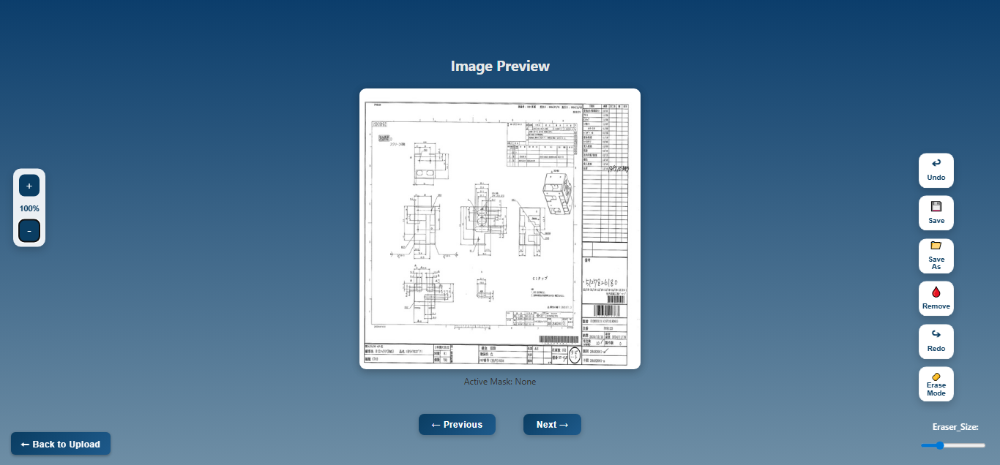

# Partdrawing Mask Viewer
A lightweight interactive web tool for viewing and editing **part drawing masks**.  
Built with **HTML, CSS, JavaScript, and Flask (Python)** for quick image upload, mask visualization, and editing.

# Features
🔹 Upload and View
- Upload two ZIP files — one containing **noisy images**, another containing **mask files**.  
- The app automatically pairs corresponding images and loads them into an interactive viewer page.
  
🔹 Viewer Interface
- Opens the selected image in a **clean, full-page viewer**.
- Displays the image at the center with smooth zoom and pan support.
- **Previous** / **Next** buttons for navigating through multiple image-mask pairs.
- **Back to Upload** button to return to the upload screen.
  
🔹 Editing Tools
- **Undo / Redo:** Easily reverse or reapply your last action.  
- **Erase Mode:** Toggle erasing for removing unwanted mask areas.  
- **Remove Mask:** Quickly clear the current mask overlay.  
- **Save / Save As:** Save the edited mask to its original or a new file.
  
🔹 Zoom Controls
- Zoom in/out using buttons or your mouse wheel.  
- Current zoom percentage is shown on the side.  
- Zoom stays centered and keeps the image in view while scaling.

# Folder Structure
Mask website/
├── static/ # CSS, JS, and images
│ ├── css/
│ └── js/
├── templates/ # HTML files
│ ├── index.html # Upload page
│ └── viewer.html # Image viewer page
├── app.py # Flask backend
└── README.md # Project overview

# Usage
1. Open **`index.html`** in your browser.
    Upload:
   - A part drawing image & A mask image to overlay.  
   - Use **← Previous Image** and **Next Image →** to switch between loaded samples.
2. Use the **Eraser Tool** page to upload drawings and erase unwanted parts.  
   Click **Save** to store changes or **Save As** to download all edited files.

# Upload Section
Users can upload ZIP files containing noisy images and masks.

# Main Section
Users can user several tools here

# Tech Stack
- **Frontend:** HTML5, CSS3, JavaScript  
- **Backend:** Python (Flask)  
- **Libraries:** OpenCV, NumPy (for mask/image processing)
  
# How It Works
1. User uploads `noisy.zip` and `mask.zip`.  
2. The server extracts both ZIPs and pairs the files.  
3. Image-mask pairs are stored temporarily and passed to the `/viewer` page.  
4. The user can then edit, erase, save, and navigate between the drawings.
